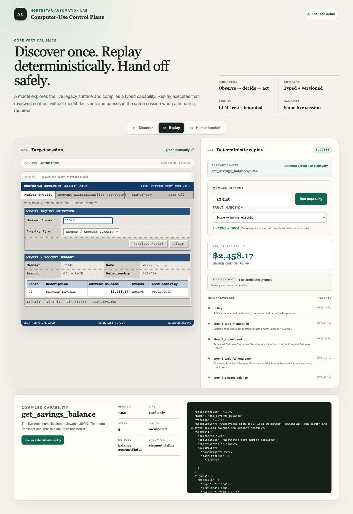
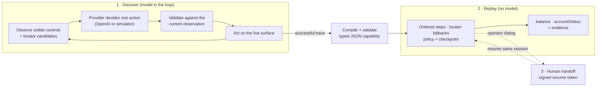

# Northstar: Computer-Use Automation for a Legacy Portal

**Discover a workflow once with an AI agent, compile it into a typed artifact, replay it
deterministically with no model in the loop, and hand control to a human in the same live
session when the workflow requires it.**


-412991?logo=openai&logoColor=white)



Northstar automates one task against a synthetic, mainframe-style credit-union portal: look
up a member's savings balance and account status. It covers that task end to end. Discovery
explores the live screen one constrained action at a time and compiles the successful run into
a versioned JSON capability. Replay executes that reviewed contract without asking a model
anything. When the portal shows an operator-only dialog, the engine pauses, hands the live
session to a person, and resumes where it stopped.

## Highlights

- **Observe → decide → act discovery.** The browser adapter lists only the controls that are
  visible right now. The model must pick one of them and copy exactly two locators from that
  control's observed candidates. The decision uses a strict JSON-schema structured output and
  is validated again before anything executes.
- **Model-free, deterministic replay.** Each step tries its declared locators in order.
  Ambiguous, missing, hidden, or disabled targets fail with explicit error codes instead of a
  best-effort click. Replay records which locator succeeded, so UI drift shows up in the logs.
- **Safety enforced in code, not in the prompt.** A goal policy rejects mutation, transfer,
  and credential requests before the target is touched. Operator-only controls are rejected
  by both the decision validator and the browser adapter. Capabilities marked irreversible or
  approval-required are blocked, and every step re-checks a same-origin path allowlist.
- **Business outcomes are separate from failures.** "Member not found" is a declared outcome,
  not a crash. Only allowlisted recoverable faults (session expiry, outcome timeout) get
  exactly one clean retry. Deadlines cancel work through `AbortSignal`.
- **Human handoff in the same session.** An ownership state machine (automation → human →
  resuming → completed or failed) plus a 15-minute HMAC-SHA-256 resume token that binds the
  goal, a redacted input fingerprint, the artifact or target, the session, and the stopped
  step. Any tampered continuation state fails closed.
- **Evidence you can audit.** Every run produces ordered, timestamped, redacted evidence. On
  failure it adds a sanitized DOM snapshot.
- **Runs without credentials.** A deterministic provider simulator implements the same
  contract as the OpenAI path. Non-local deployments always use the simulator, so the demo
  can't become a public proxy for a paid model.

## How it works



A compiled capability declares its target and allowlist, typed inputs and outputs, risk
policy, ordered steps with fallback locators, known business outcomes, time limits, and a
success checkpoint:

```jsonc
{
  "schemaVersion": "1.0",
  "name": "get_savings_balance",
  "version": "1.1.0",
  // "target": web surface, entry point /legacy, same-origin allowlist
  "inputs": {
    "memberId": { "type": "string", "required": true, "pattern": "^[0-9]{5}$", "sensitive": true }
  },
  "outputs": {
    "balance": { "type": "currency", "currency": "USD" },
    "accountStatus": { "type": "string", "allowedValues": ["Active", "Restricted"] }
  },
  "policy": {
    "allowedActions": ["type", "click", "wait_for_outcome", "extract"],
    "risk": "read_only", "maxSteps": 8, "runTimeoutMs": 15000, "requiresHumanApproval": false
  },
  "steps": [
    {
      "id": "enter_member_id", "action": "type", "input": "memberId",
      "target": {
        "description": "Member Number input",
        "locators": [
          { "kind": "name", "value": "member_number" },
          { "kind": "css", "value": "input[maxlength='5']" }
        ]
      }
    }
    // then: click "Retrieve Record", wait for success or member_not_found,
    // extract the balance, extract the status, and verify the checkpoint
  ]
}
```

The full reviewed baseline is in
[`capabilities/get-savings-balance.v1.json`](capabilities/get-savings-balance.v1.json).

## Try it

Requirements: Node.js 22.13+ and pnpm. The browser tests also need Playwright's Chromium.

```bash
pnpm install
pnpm exec playwright install chromium
cp .env.example .env.local
pnpm run dev
```

Open `http://localhost:3000`. `OPENAI_API_KEY` is optional. Without it, discovery uses the
local simulator. With it, discovery on `localhost` uses `OPENAI_DISCOVERY_MODEL` through the
server decision route.

### Demo walkthrough

1. **Discover:** keep the default read-only goal, the allowlisted `/legacy` target, and member
   `12345`, then select **Discover capability**. Inspect the evidence and the compiled
   `1.2.0` artifact.
2. **Reject an unsupported goal:** enter "Terminate the member savings account and report its
   balance and status." Discovery returns `unsupported_goal` before preparing the target.
3. **Replay:** open **Replay**, run `12345`, and confirm `$2,458.17`, `Active`, the locator
   evidence, and the declared checkpoint.
4. **Business outcome:** replay `00000`. The result is `member_not_found`, not a crash.
5. **Recovery:** select the session-expired fault and replay `12345`. The executor records the
   recoverable failure and performs one clean retry.
6. **Hard failure:** select the application-error fault. Replay stops without retrying.
7. **Discovery handoff:** discover with `31415`, accept control, click **Continue lookup**
   inside the live target, and resume. The same session compiles the artifact.
8. **Replay handoff:** open **Human handoff**, start assisted replay, accept control, click
   **Continue lookup**, and resume. The same session reaches the checkpoint.

## Tests and evidence

```bash
pnpm test                    # 39 unit tests: discovery, executor, capability, handoff
pnpm run test:e2e            # 3 Playwright scenarios in real Chromium
pnpm run typecheck
pnpm run lint
pnpm run build
pnpm run evidence:generate   # deterministic; rerunning does not change the committed JSON
pnpm run verify:submission
```

Playwright starts the app on `127.0.0.1` and forces the deterministic simulator even if an API
key is present. The [`evidence/`](evidence) folder holds the captured runs: discovery,
replay of the exact generated artifact, a business outcome, a handoff, a sanitized hard
failure, and the real Chromium screenshot above.

## Tech stack

| Area | Technology |
|---|---|
| App | Next.js 16 (App Router) on [vinext](https://www.npmjs.com/package/vinext) (Vite), React 19, TypeScript, Tailwind CSS 4 |
| Agent | OpenAI Responses API with strict structured outputs, plus a deterministic simulator behind the same provider interface |
| Browser automation | Same-origin iframe adapters over the live DOM |
| Security | Web Crypto HMAC-SHA-256 resume tokens, redaction, path allowlists |
| Testing | Node test runner, Playwright, ESLint, `tsc` |
| Runtime | Cloudflare Workers-compatible build (Wrangler) |

## Project map

| Path | Responsibility |
|---|---|
| [`lib/discovery/core.ts`](lib/discovery/core.ts) | Goal policy, observation-bound decision validation, trace execution, resume, artifact compilation |
| [`lib/automation/core.ts`](lib/automation/core.ts) | Artifact validation, deterministic executor, policy, evidence, bounded recovery |
| [`lib/browser/live-surface.ts`](lib/browser/live-surface.ts) | Adapters that observe and operate the embedded legacy surface |
| [`lib/handoff/core.ts`](lib/handoff/core.ts) | Ownership state machine and redacted human-action recording |
| [`lib/resume-token.ts`](lib/resume-token.ts) | Signed, expiring continuation tokens |
| [`lib/discovery/openai.ts`](lib/discovery/openai.ts) | OpenAI Responses API decision provider |
| [`app/page.tsx`](app/page.tsx) | Discovery, replay, evidence, and handoff console |
| [`app/legacy/page.tsx`](app/legacy/page.tsx) | Synthetic legacy member-services portal with fault modes |

## Design write-up

[REPORT.md](REPORT.md) explains the architecture, the artifact schema, determinism and error
handling, how the design would extend to other surfaces and tenants, escalation, safety, and
what was deliberately cut.

## Scope

This is a focused local demo, not a production banking system. The portal, members, and
balances are synthetic. It deliberately implements one read-only web workflow in depth rather
than claiming desktop or terminal automation. The report describes the next steps: a
server-held resume store with key rotation, then version-aware drift quarantine and reviewed
per-tenant overlays.
